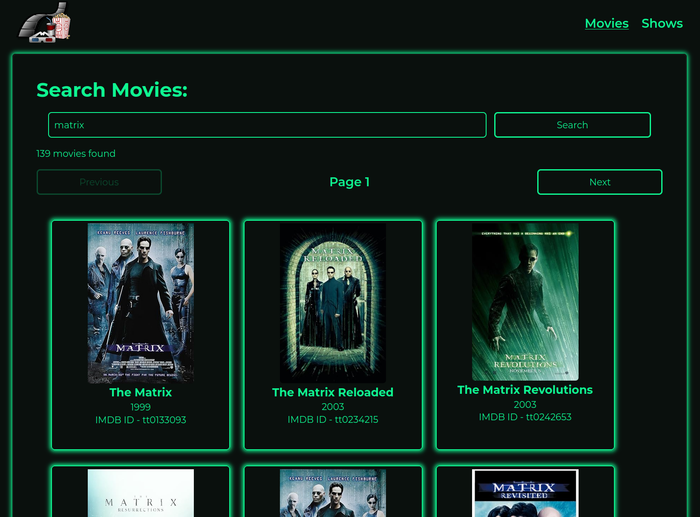

# TV Guide

## Tech Stack

- Vite
- React.js

## Features

- This project uses the [OMDb API](https://www.omdbapi.com/) to support you in finding out more about your favourite movies and TV shows.
- The application has a page for movie searches (/movies) and a page for TV show searches (/shows).
- Details about the movie/show are open in the /details:id page.
